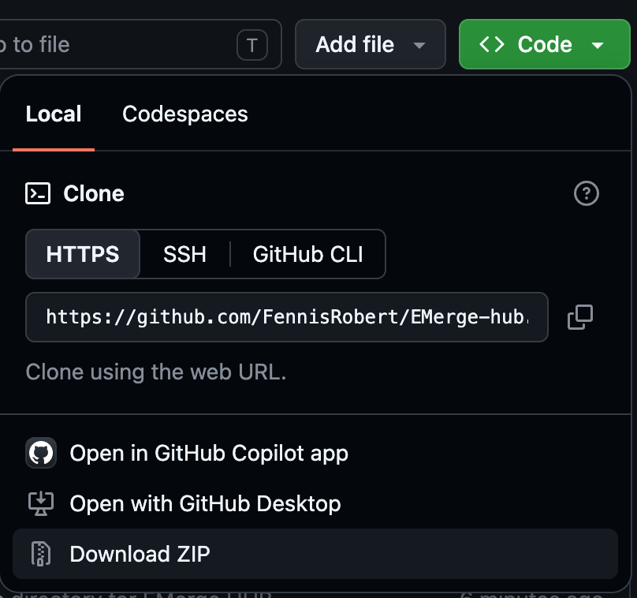

# How to use

Welcome to the Templates directory. The use of this is very simple.

Each model is designed to work with EMerge. Simply download the folder or copy paste the contents of the simulation python file to a local directory and run the script!

## For people who don't know much Github
The simplest way to get access to all the files is to to the Github home page, click the green `Code` button and then click the `Download ZIP` button. You can then copy and paste the files that you need at will. 

While the repository contains a lot of folders, there is no sense in which it requires the directory structure to stay intact. Its just a loose collection of files and scripts. 

